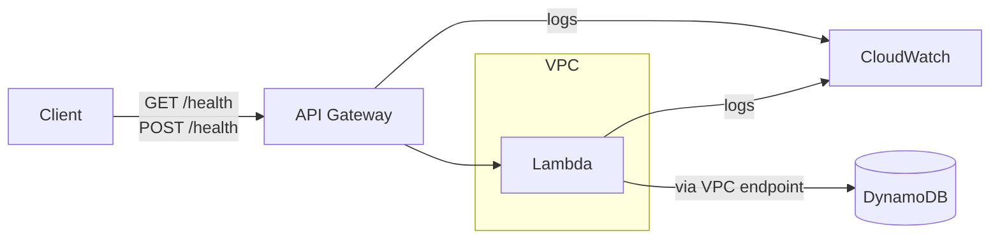
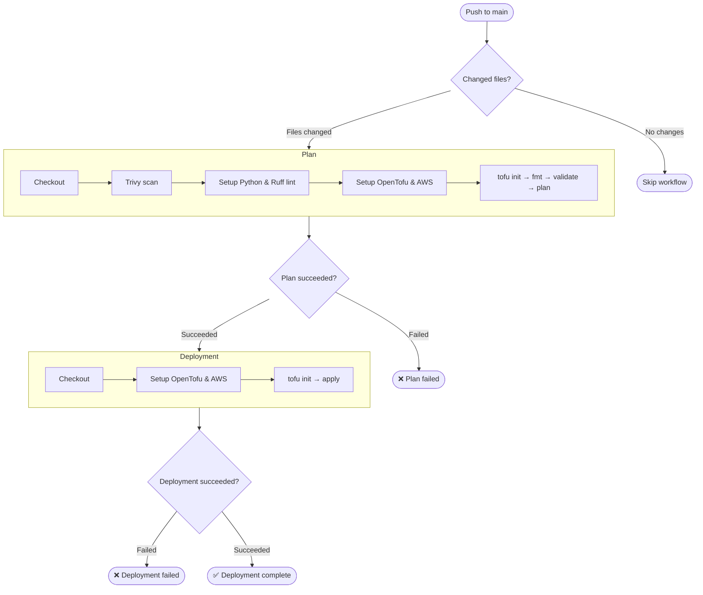

# Lum Task

This repository contains code to deploy infrastructure in AWS to complete Lum Task: Serverless Health Check API with
CI/CD.

Repository terraform code was made to run on OpenTofu, but you should also be able to run it on original TerraForm with
no issues.

## Architecture & Tech Stack

### Decisions

- OpenTofu has been used instead of Terraform as it is fully compatible and licensed under proper open source license.
- S3 bucket is used to allow tfstate syncing between local and GitHub runs.
- Trivy is used for security checks as it is lightweight and quick Go-based option that supports many checks including
  Python used for Lambda and tofu configuration files. Some of its checks have been suppressed to not increase
  complexity of the project.
- Ruff is used for Python to validate Lambda code quality and style.
- Some IAM rules use wildcard resources where ARNs are unsupported or unknown until after resource creation. These
  should be reviewed and scoped to specific resources before deploying to a real production environment.

### Client traffic flow



### GH Action flow



# Usage

## Prepare AWS environment

### S3 Setup

1. Create new general purpose bucket for tfstate storage.
2. Use bucket's name in [main.tf](./main.tf) "backend s3" configuration section and replace
   `4av1s9fudz9dtvzgt765-tofu-state` values in [role_perm_policy.json](./docs/policies/role_perm_policy.json) with name
   of
   your S3 bucket.

### IAM Setup

#### Identity Provider

Create `token.actions.githubusercontent.com` identity provider with `sts.amazonaws.com` audience. It is required for GH
Actions.

#### Policies

Create policies:

- "tofu-deploy-role-policy" - sets permissions required for pipeline to run, example config can be
  found [here](./docs/policies/role_perm_policy.json). Replace `arn:aws:s3:::4av1s9fudz9dtvzgt765-tofu-state` with
  ARN of your S3 state bucket. Also check other resource values if you have changed their names in OpenTofu
  configuration files.
- "tofu-deploy-user-policy" - allows to link "tofu-deploy" user with "tofu-deploy" role, example config can be
  found [here](./docs/policies/user_perm_policy.json). Replace `arn:aws:iam::285051607148:role/tofu-deploy` with ARN of
  your role.

#### Roles

Create role `tofu-deploy` with `tofu-deploy-role-policy` permission policy
and role trust policy applied, use config example from [here](./docs/policies/role_trust_policy.json). Replace
`arn:aws:iam::285051607148:user/tofu-deploy` with ARN of your user,
`arn:aws:iam::285051607148:oidc-provider/token.actions.githubusercontent.com` with ARN of your GitHub identity
provider, `tengzl33t/lum-task` with your GH repository path.

#### User (optional)

Only needed if you want to run OpenTofu locally. Skip this if you're only using GitHub Actions.

1. Create user `tofu-deploy` and apply `tofu-deploy-user-policy` to it.
2. Create access key (in "Security credentials") for local runs.

## Local changes

- Fill `~/.aws/config/` with your information of your AWS region, and previously created user and role using this
  template:

```ini
[profile tofu-deploy-user]
aws_access_key_id = USER_ACCESS_KEY_ID
aws_secret_access_key = USER_SECRET_ACCESS_KEY
region = YOUR_AWS_REGION

[profile tofu-deploy]
role_arn = YOUR_ROLE_ARN
source_profile = tofu-deploy-user
region = YOUR_AWS_REGION
```

- Export variables `AWS_PROFILE=tofu-deploy` and `AWS_REGION=YOUR_AWS_REGION`.

## Running Tofu locally

1. Install required packages: https://opentofu.org/docs/intro/install/
   or https://developer.hashicorp.com/terraform/install.
2. Initialize working directory:
    - Run`tofu init -backend-config="key=staging/terraform.tfstate" -reconfigure` for staging env.
    - Run`tofu init -backend-config="key=prod/terraform.tfstate" -reconfigure` for production env.
3. Run `tofu validate` to validate the configuration.
4. Run `tofu plan` to see the planned changes.
5. Run `tofu apply -var-file="staging.tfvars"` for staging, or `-var-file="prod.tfvars"` for production env. Change
   variables present in `.tfvars` files if needed.

## Running Tofu in GH Actions

- No explicit configuration needed as everything is already present in [workflow files](./.github/workflows).
- Actions use variable `AWS_REGION` and secret `AWS_ROLE_ARN` to provide required information. Credentials are
  provided automatically via OIDC integration.
- [validate.yml](./.github/workflows/validate.yml) action is used for resource validation, it does not deploy anything,
  and so does not require any approvals.
- [deploy.yml](./.github/workflows/deploy.yml) action is used for deployment, only for main branch, it requires manual
  approval from the repository admin.

## Checking the endpoint availability

If workflow succeeded you will get /health endpoint link in the end of execution, it can be accessed with browser or
by curl:

```shell
curl --request POST \
  --url LINK_YOU_GOT \
  --header 'content-type: application/json' \
  --data '{
  "payload": "paaaaaylooooood"
}'
```

or wget

```shell
wget --quiet \
--method POST \
--header 'content-type: application/json' \
--body-data '{"payload": "paaaaaylooooood"}' \
--output-document \
- LINK_YOU_GOT
```
